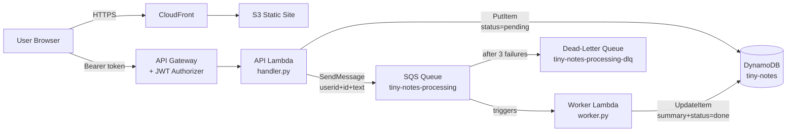

# Tiny Notes Lab — Stage 5

Stage 5 adds **async processing with SQS**. When a note is created the API returns immediately; a separate worker Lambda picks up the message and enriches the note in the background.

## What changed from Stage 4

| Layer    | Change |
|----------|--------|
| Frontend | `processedStatus` badge on each note; auto-polls every 3 s while any note is `pending` |
| API Lambda | Stamps new notes with `processedStatus: pending`; publishes `{userId, id, text}` to SQS |
| Worker Lambda | New — triggered by SQS; computes `summary` (word count), writes `done` status back to DynamoDB |
| Infrastructure | SQS standard queue + dead-letter queue (DLQ) |

## Files

```
index.html
style.css
app.js
lambda/
  handler.py    ← API Lambda (updated)
  worker.py     ← Worker Lambda (new)
```

## Queue Design

### Main queue — `tiny-notes-processing`

| Setting | Value | Why |
|---------|-------|-----|
| Type | Standard | Order doesn't matter; at-least-once delivery is fine |
| Visibility timeout | 30 s | Must be ≥ Lambda timeout so in-flight messages stay hidden during processing |
| Message retention | 4 days | Default; messages older than this are dropped |
| Max receive count | 3 | After 3 failed attempts the message moves to the DLQ |

### Dead-letter queue — `tiny-notes-processing-dlq`

| Setting | Value | Why |
|---------|-------|-----|
| Type | Standard | Same as source queue |
| Message retention | 14 days | Longer retention gives time to inspect and replay failures |

**Message format** — the API Lambda sends:
```json
{ "userId": "cognito-sub", "id": "uuid", "text": "note content" }
```

The text is included in the message so the worker is self-contained and needs no DynamoDB read permission.

**Failure behaviour** — if `worker.handler` raises an uncaught exception, Lambda does not delete the message. SQS makes it visible again after the visibility timeout. After 3 attempts (`maxReceiveCount`) the message is moved to the DLQ automatically.

---

## AWS Deployment

### Prerequisites
- Existing setup from Stages 1–4 (S3, CloudFront, Cognito, API Gateway, API Lambda, DynamoDB)
- AWS CLI configured

---

### Step 1 — Create the DLQ

```bash
DLQ_URL=$(aws sqs create-queue \
  --queue-name tiny-notes-processing-dlq \
  --attributes MessageRetentionPeriod=1209600 \
  --query 'QueueUrl' --output text)

DLQ_ARN=$(aws sqs get-queue-attributes \
  --queue-url $DLQ_URL \
  --attribute-names QueueArn \
  --query 'Attributes.QueueArn' --output text)

echo "DLQ ARN: $DLQ_ARN"
```

---

### Step 2 — Create the Main Queue

```bash
REDRIVE=$(printf '{"deadLetterTargetArn":"%s","maxReceiveCount":"3"}' "$DLQ_ARN")

QUEUE_URL=$(aws sqs create-queue \
  --queue-name tiny-notes-processing \
  --attributes \
    VisibilityTimeout=30 \
    "RedrivePolicy=${REDRIVE}" \
  --query 'QueueUrl' --output text)

QUEUE_ARN=$(aws sqs get-queue-attributes \
  --queue-url $QUEUE_URL \
  --attribute-names QueueArn \
  --query 'Attributes.QueueArn' --output text)

echo "Queue URL: $QUEUE_URL"
```

---

### Step 3 — Grant the API Lambda Permission to Send Messages

```bash
aws iam put-role-policy \
  --role-name tiny-notes-lambda-role \
  --policy-name TinyNotesSQSSend \
  --policy-document "{
    \"Version\": \"2012-10-17\",
    \"Statement\": [{
      \"Effect\": \"Allow\",
      \"Action\": [\"sqs:SendMessage\"],
      \"Resource\": \"${QUEUE_ARN}\"
    }]
  }"
```

---

### Step 4 — Update the API Lambda

Add the `QUEUE_URL` environment variable and deploy the updated code.

```bash
aws lambda update-function-configuration \
  --function-name tiny-notes \
  --environment "Variables={TABLE_NAME=tiny-notes,QUEUE_URL=${QUEUE_URL}}"

cd lambda && zip api.zip handler.py && cd ..
aws lambda update-function-code \
  --function-name tiny-notes \
  --zip-file fileb://lambda/api.zip
```

---

### Step 5 — Create the Worker Lambda

**IAM role for the worker:**

```bash
aws iam create-role \
  --role-name tiny-notes-worker-role \
  --assume-role-policy-document '{
    "Version": "2012-10-17",
    "Statement": [{
      "Effect": "Allow",
      "Principal": {"Service": "lambda.amazonaws.com"},
      "Action": "sts:AssumeRole"
    }]
  }'

# CloudWatch Logs
aws iam attach-role-policy \
  --role-name tiny-notes-worker-role \
  --policy-arn arn:aws:iam::aws:policy/service-role/AWSLambdaBasicExecutionRole

# SQS receive + delete (required for event source mapping)
aws iam attach-role-policy \
  --role-name tiny-notes-worker-role \
  --policy-arn arn:aws:iam::aws:policy/service-role/AWSLambdaSQSQueueExecutionRole

# DynamoDB UpdateItem
aws iam put-role-policy \
  --role-name tiny-notes-worker-role \
  --policy-name TinyNotesWorkerDynamo \
  --policy-document '{
    "Version": "2012-10-17",
    "Statement": [{
      "Effect": "Allow",
      "Action": ["dynamodb:UpdateItem"],
      "Resource": "arn:aws:dynamodb:us-east-1:YOUR_ACCOUNT_ID:table/tiny-notes"
    }]
  }'
```

**Create the Lambda function:**

```bash
WORKER_ROLE_ARN=$(aws iam get-role \
  --role-name tiny-notes-worker-role \
  --query 'Role.Arn' --output text)

cd lambda && zip worker.zip worker.py && cd ..

aws lambda create-function \
  --function-name tiny-notes-worker \
  --runtime python3.12 \
  --handler worker.handler \
  --role $WORKER_ROLE_ARN \
  --zip-file fileb://lambda/worker.zip \
  --environment Variables={TABLE_NAME=tiny-notes} \
  --timeout 30 \
  --region us-east-1
```

> The worker timeout (30 s) must be ≤ the queue's visibility timeout (30 s). If the Lambda runs longer than the visibility timeout, SQS makes the message visible again before the Lambda finishes — causing duplicate processing.

---

### Step 6 — Connect SQS to the Worker Lambda

```bash
aws lambda create-event-source-mapping \
  --function-name tiny-notes-worker \
  --event-source-arn $QUEUE_ARN \
  --batch-size 10 \
  --maximum-batching-window-in-seconds 5
```

Lambda will now poll the queue automatically. No API Gateway route is needed — SQS invokes the worker directly.

**To update the worker code later:**

```bash
cd lambda && zip worker.zip worker.py && cd ..
aws lambda update-function-code \
  --function-name tiny-notes-worker \
  --zip-file fileb://lambda/worker.zip
```

---

### Step 7 — Upload Frontend and Invalidate Cache

```bash
aws s3 sync . s3://your-bucket-name \
  --exclude "*" \
  --include "index.html" \
  --include "style.css" \
  --include "app.js"

aws cloudfront create-invalidation \
  --distribution-id YOUR_DISTRIBUTION_ID \
  --paths "/*"
```

---

## Architecture



---

## What's Next — Stage 6

Allow users to attach a file to a note using **S3 presigned upload URLs**.
