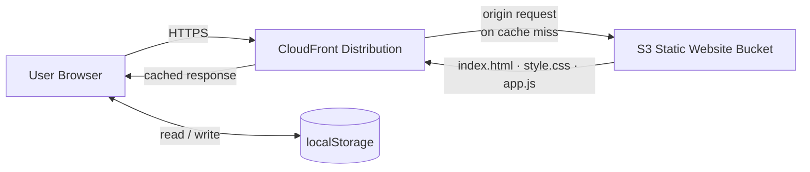

# Tiny Notes Lab — Stage 2

A minimal frontend-only notes app. Notes are saved in the browser's `localStorage`. No backend, no build step.

Stage 2 adds **CloudFront** as a CDN in front of the S3 bucket. The app code is unchanged.

## Files

```
index.html
style.css
app.js
```

## Run Locally

Open `index.html` directly in a browser — no server needed.

If you prefer a local server:

```bash
python3 -m http.server 8080
# open http://localhost:8080
```

---

## AWS Deployment

### Prerequisites
- AWS account
- AWS CLI configured (`aws configure`)

---

### Part 1 — S3 Origin (same as Stage 1)

**1. Create and configure the bucket**

```bash
aws s3 mb s3://your-bucket-name --region us-east-1

aws s3 website s3://your-bucket-name \
  --index-document index.html
```

**2. Allow public read** *(required when CloudFront uses the S3 website endpoint)*

In the S3 console: Permissions → Block public access → uncheck all → Save.

Create `bucket-policy.json`:

```json
{
  "Version": "2012-10-17",
  "Statement": [
    {
      "Effect": "Allow",
      "Principal": "*",
      "Action": "s3:GetObject",
      "Resource": "arn:aws:s3:::your-bucket-name/*"
    }
  ]
}
```

```bash
aws s3api put-bucket-policy \
  --bucket your-bucket-name \
  --policy file://bucket-policy.json
```

**3. Upload files**

```bash
aws s3 sync . s3://your-bucket-name \
  --exclude "*" \
  --include "index.html" \
  --include "style.css" \
  --include "app.js"
```

---

### Part 2 — CloudFront Distribution

**4. Create the distribution**

```bash
aws cloudfront create-distribution \
  --origin-domain-name your-bucket-name.s3-website-us-east-1.amazonaws.com \
  --default-root-object index.html
```

> Use the **S3 website endpoint** (`.s3-website-<region>.amazonaws.com`) as the origin, not the REST endpoint. This ensures index.html is served correctly.

Note the `DomainName` and `Id` from the response — you'll need them.

**5. Wait for deployment** (~5–10 minutes)

```bash
aws cloudfront wait distribution-deployed \
  --id YOUR_DISTRIBUTION_ID
```

**6. Access the app**

```
https://xxxxxxxxxxxx.cloudfront.net
```

---

### Part 3 — Updating the App (Cache Invalidation)

After uploading new files to S3, CloudFront serves the cached version until TTL expires. Force an immediate update:

```bash
# Upload changes
aws s3 sync . s3://your-bucket-name \
  --exclude "*" \
  --include "index.html" \
  --include "style.css" \
  --include "app.js"

# Invalidate the cache
aws cloudfront create-invalidation \
  --distribution-id YOUR_DISTRIBUTION_ID \
  --paths "/*"
```

> `/*` invalidates everything. You can target specific files (e.g. `"/index.html"`) to reduce cost — AWS gives 1,000 invalidation paths free per month.

---

### Optional — HTTPS with a Custom Domain (ACM)

1. Request a public certificate in **AWS Certificate Manager (ACM)** — must be in `us-east-1` for CloudFront.
2. In the CloudFront distribution settings, add your domain as an **Alternate Domain Name (CNAME)**.
3. Attach the ACM certificate under **Custom SSL Certificate**.
4. In your DNS provider, create a `CNAME` record pointing your domain to the CloudFront domain (`xxxx.cloudfront.net`).

---

## Architecture



**CloudFront caches** the static files at edge locations worldwide. S3 is only hit on a cache miss. Notes still live entirely in the browser — no data is sent to AWS.

---

## What's Next — Stage 3

Replace `localStorage` with a real backend: API Gateway + Lambda + DynamoDB.
