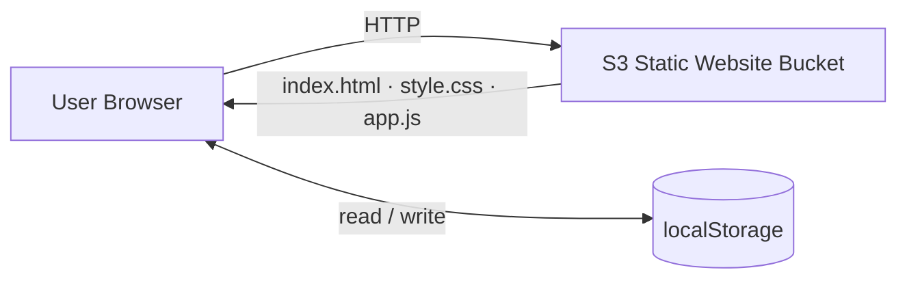

# Tiny Notes Lab — Stage 1

A minimal frontend-only notes app. Notes are saved in the browser's `localStorage`. No backend, no build step.

## Files

```
index.html
style.css
app.js
```

## Run Locally

Open `index.html` directly in a browser — no server needed.

If you prefer a local server (avoids some browser restrictions):

```bash
# Python 3
python3 -m http.server 8080
# then open http://localhost:8080
```

---

## AWS Deployment — S3 Static Website Hosting

### What you need
- An AWS account
- AWS CLI configured (`aws configure`)

### Steps

**1. Create an S3 bucket**

```bash
aws s3 mb s3://your-bucket-name --region us-east-1
```

**2. Enable static website hosting**

```bash
aws s3 website s3://your-bucket-name \
  --index-document index.html
```

**3. Set a public-read bucket policy**

Create `bucket-policy.json`:

```json
{
  "Version": "2012-10-17",
  "Statement": [
    {
      "Effect": "Allow",
      "Principal": "*",
      "Action": "s3:GetObject",
      "Resource": "arn:aws:s3:::your-bucket-name/*"
    }
  ]
}
```

Apply it:

```bash
aws s3api put-bucket-policy \
  --bucket your-bucket-name \
  --policy file://bucket-policy.json
```

> Note: You may need to disable "Block all public access" in the S3 console first (Permissions tab → Block public access → Edit → uncheck all → Save).

**4. Upload the files**

```bash
aws s3 sync . s3://your-bucket-name \
  --exclude "*" \
  --include "index.html" \
  --include "style.css" \
  --include "app.js"
```

**5. Get the website URL**

```
http://your-bucket-name.s3-website-us-east-1.amazonaws.com
```

Replace `your-bucket-name` and `us-east-1` with your actual bucket name and region.

---

## Architecture



**Notes live entirely in the browser.** S3 only serves the static files. No data is sent to AWS.

---

## What's Next — Stage 2

Add a CloudFront distribution in front of S3 for CDN delivery and HTTPS.
