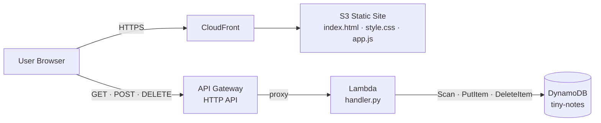

# Tiny Notes Lab — Stage 3

Notes are now stored in **DynamoDB** and served through **API Gateway + Lambda**. The frontend is still plain HTML/CSS/JS — it just calls the API instead of localStorage.

## Files

```
index.html
style.css
app.js                  ← update API_BASE before uploading
lambda/
  handler.py            ← single Lambda function for all routes
```

## DynamoDB Table Schema

| Attribute   | Type   | Role          |
|-------------|--------|---------------|
| `id`        | String | Partition key — UUID v4 |
| `text`      | String | Note content  |
| `createdAt` | String | ISO 8601 UTC timestamp |

- **Billing mode:** PAY_PER_REQUEST — no capacity to provision, stays in free tier for low traffic.
- **No sort key** — notes are fetched with `scan()` and sorted by `createdAt` in Lambda. Fine for a small dataset; a real app would use a GSI.
- One table, no user scoping yet (added in Stage 4 with Cognito).

---

## AWS Deployment

### Prerequisites

- AWS CLI configured (`aws configure`)
- An existing S3 bucket and CloudFront distribution from Stages 1–2

---

### Step 1 — DynamoDB

```bash
aws dynamodb create-table \
  --table-name tiny-notes \
  --attribute-definitions AttributeName=id,AttributeType=S \
  --key-schema AttributeName=id,KeyType=HASH \
  --billing-mode PAY_PER_REQUEST \
  --region us-east-1
```

---

### Step 2 — IAM Role for Lambda

Lambda needs permission to write CloudWatch Logs and access the DynamoDB table.

```bash
# Create the role
aws iam create-role \
  --role-name tiny-notes-lambda-role \
  --assume-role-policy-document '{
    "Version": "2012-10-17",
    "Statement": [{
      "Effect": "Allow",
      "Principal": {"Service": "lambda.amazonaws.com"},
      "Action": "sts:AssumeRole"
    }]
  }'

# CloudWatch Logs (managed policy)
aws iam attach-role-policy \
  --role-name tiny-notes-lambda-role \
  --policy-arn arn:aws:iam::aws:policy/service-role/AWSLambdaBasicExecutionRole

# DynamoDB access (inline policy — least-privilege)
aws iam put-role-policy \
  --role-name tiny-notes-lambda-role \
  --policy-name TinyNotesDynamo \
  --policy-document '{
    "Version": "2012-10-17",
    "Statement": [{
      "Effect": "Allow",
      "Action": ["dynamodb:Scan", "dynamodb:PutItem", "dynamodb:DeleteItem"],
      "Resource": "arn:aws:dynamodb:us-east-1:YOUR_ACCOUNT_ID:table/tiny-notes"
    }]
  }'
```

> Find your account ID: `aws sts get-caller-identity --query Account --output text`

---

### Step 3 — Lambda Function

```bash
cd lambda
zip function.zip handler.py
cd ..

ROLE_ARN=$(aws iam get-role \
  --role-name tiny-notes-lambda-role \
  --query 'Role.Arn' --output text)

aws lambda create-function \
  --function-name tiny-notes \
  --runtime python3.12 \
  --handler handler.handler \
  --role $ROLE_ARN \
  --zip-file fileb://lambda/function.zip \
  --environment Variables={TABLE_NAME=tiny-notes} \
  --region us-east-1
```

**To redeploy Lambda code after changes:**

```bash
cd lambda && zip function.zip handler.py && cd ..
aws lambda update-function-code \
  --function-name tiny-notes \
  --zip-file fileb://lambda/function.zip
```

---

### Step 4 — API Gateway (HTTP API)

**Why HTTP API, not REST API?** HTTP API is simpler, cheaper, and supports CORS configuration at the API level — ideal here.

**Why configure CORS at the API level?** The browser sends a preflight `OPTIONS` request before `POST` and `DELETE` calls. API Gateway intercepts these automatically when CORS is configured, so the Lambda never has to handle them.

```bash
# Create the API with CORS enabled for all origins
API_ID=$(aws apigatewayv2 create-api \
  --name tiny-notes-api \
  --protocol-type HTTP \
  --cors-configuration 'AllowOrigins=["*"],AllowMethods=["GET","POST","DELETE"],AllowHeaders=["Content-Type"]' \
  --query 'ApiId' --output text)

# Get the Lambda ARN
LAMBDA_ARN=$(aws lambda get-function \
  --function-name tiny-notes \
  --query 'Configuration.FunctionArn' --output text)

# Create a single Lambda integration (all routes share it)
INT_ID=$(aws apigatewayv2 create-integration \
  --api-id $API_ID \
  --integration-type AWS_PROXY \
  --integration-uri $LAMBDA_ARN \
  --payload-format-version 2.0 \
  --query 'IntegrationId' --output text)

# Create the three routes
aws apigatewayv2 create-route --api-id $API_ID \
  --route-key 'GET /notes'         --target "integrations/$INT_ID"

aws apigatewayv2 create-route --api-id $API_ID \
  --route-key 'POST /notes'        --target "integrations/$INT_ID"

aws apigatewayv2 create-route --api-id $API_ID \
  --route-key 'DELETE /notes/{id}' --target "integrations/$INT_ID"

# Create $default stage with auto-deploy (no manual deploys needed)
aws apigatewayv2 create-stage \
  --api-id $API_ID \
  --stage-name '$default' \
  --auto-deploy

# Grant API Gateway permission to invoke Lambda
ACCOUNT_ID=$(aws sts get-caller-identity --query Account --output text)

aws lambda add-permission \
  --function-name tiny-notes \
  --statement-id apigw-invoke \
  --action lambda:InvokeFunction \
  --principal apigateway.amazonaws.com \
  --source-arn "arn:aws:execute-api:us-east-1:${ACCOUNT_ID}:${API_ID}/*"

# Print the base URL — copy this into app.js
aws apigatewayv2 get-api --api-id $API_ID \
  --query 'ApiEndpoint' --output text
```

The output looks like:
```
https://xxxxxxxxxxxx.execute-api.us-east-1.amazonaws.com
```

---

### Step 5 — Update the Frontend

In `app.js`, replace:

```javascript
const API_BASE = 'https://YOUR_API_ID.execute-api.us-east-1.amazonaws.com';
```

with the URL printed in Step 4.

---

### Step 6 — Upload to S3

```bash
aws s3 sync . s3://your-bucket-name \
  --exclude "*" \
  --include "index.html" \
  --include "style.css" \
  --include "app.js"
```

---

### Step 7 — Invalidate CloudFront Cache

```bash
aws cloudfront create-invalidation \
  --distribution-id YOUR_DISTRIBUTION_ID \
  --paths "/*"
```

---

## Architecture



Notes are now stored in DynamoDB. The browser no longer uses localStorage. CloudFront still serves the static files; API Gateway is called directly from the browser.

---

## What's Next — Stage 4

Add user authentication with **Amazon Cognito** so each user only sees their own notes.
