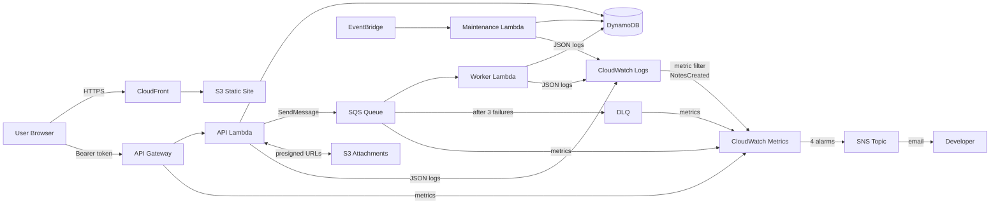

# Tiny Notes Lab — Stage 8

Stage 8 adds **CloudWatch observability**: structured logging across all Lambdas, alarms for the three most important failure signals, a dashboard, and Log Insights queries for investigation.

## What changed from Stage 7

| Layer | Change |
|-------|--------|
| All three Lambdas | Shared `log()` helper; JSON log lines on every key action and error |
| Worker Lambda | `try/except` per SQS record — errors are logged before re-raising so the DLQ alarm fires rather than silently swallowing failures |
| Infrastructure | SNS alert topic · 4 CloudWatch alarms · 1 dashboard · 1 log metric filter |

## Files

```
lambda/
  handler.py      ← log() added; note_created, note_deleted, upload_url_generated, s3_cleanup_failed
  worker.py       ← log() added; note_processed, processing_failed; try/except per record
  maintenance.py  ← log() added; maintenance_started, maintenance_complete
```

---

## Structured Logging Pattern

Every Lambda now contains:

```python
def log(level, **kwargs):
    print(json.dumps({'level': level, **kwargs}))
```

`print()` in Lambda writes to CloudWatch Logs. JSON lines are directly queryable with Log Insights. Every call site documents itself:

```python
log('INFO',  action='note_created',        noteId=note['id'])
log('INFO',  action='note_processed',      noteId=note_id, summary=summary)
log('WARN',  action='s3_cleanup_failed',   noteId=note_id, error=str(e))
log('ERROR', action='processing_failed',   noteId=note_id, error=str(e))
log('INFO',  action='maintenance_complete', archived=2, cutoff='2026-...')
```

**Why not use the `logging` module?** `print()` to stdout in Lambda writes the raw string to CloudWatch Logs. `logging` adds a prefix (`INFO:root:...`) that breaks JSON parsing. For structured JSON, `print` is correct.

**Why re-raise after logging in the worker?** If we catch and swallow the exception, SQS deletes the message — no retry, no DLQ. Re-raising means SQS retries up to `maxReceiveCount`, then moves the message to the DLQ, which triggers the DLQ alarm.

---

## AWS Deployment

### Prerequisites
- Existing setup from Stages 1–7
- AWS CLI configured

---

### Step 1 — Redeploy All Three Lambdas

```bash
cd lambda

zip api.zip         handler.py    && aws lambda update-function-code \
  --function-name tiny-notes            --zip-file fileb://api.zip

zip worker.zip      worker.py     && aws lambda update-function-code \
  --function-name tiny-notes-worker     --zip-file fileb://worker.zip

zip maintenance.zip maintenance.py && aws lambda update-function-code \
  --function-name tiny-notes-maintenance --zip-file fileb://maintenance.zip

cd ..
```

---

### Step 2 — Create an SNS Alert Topic

All alarms send to one SNS topic. Subscribe your email to receive notifications.

```bash
SNS_ARN=$(aws sns create-topic \
  --name tiny-notes-alerts \
  --query TopicArn --output text)

aws sns subscribe \
  --topic-arn $SNS_ARN \
  --protocol email \
  --notification-endpoint your@email.com

echo "SNS ARN: $SNS_ARN"
```

> Check your inbox and confirm the subscription before alarms can deliver.

---

### Step 3 — CloudWatch Alarms

**Why these four?** Each targets a distinct failure mode:

| Alarm | What it catches |
|-------|----------------|
| DLQ not empty | SQS worker failed to process a note after 3 retries |
| API Lambda errors | Unhandled exceptions in the request path (DynamoDB errors, auth failures) |
| Worker Lambda errors | Processing failures that are being retried |
| API Gateway 5xx | Infrastructure-level failures not caught inside Lambda |

```bash
# 1. Dead-letter queue depth — any unprocessable message is worth investigating
aws cloudwatch put-metric-alarm \
  --alarm-name tiny-notes-dlq-not-empty \
  --namespace AWS/SQS \
  --metric-name ApproximateNumberOfMessagesVisible \
  --dimensions Name=QueueName,Value=tiny-notes-processing-dlq \
  --statistic Maximum \
  --period 60 \
  --evaluation-periods 1 \
  --threshold 0 \
  --comparison-operator GreaterThanThreshold \
  --treat-missing-data notBreaching \
  --alarm-actions $SNS_ARN

# 2. API Lambda errors — ≥5 errors in a 5-minute window
aws cloudwatch put-metric-alarm \
  --alarm-name tiny-notes-api-lambda-errors \
  --namespace AWS/Lambda \
  --metric-name Errors \
  --dimensions Name=FunctionName,Value=tiny-notes \
  --statistic Sum \
  --period 300 \
  --evaluation-periods 1 \
  --threshold 5 \
  --comparison-operator GreaterThanOrEqualToThreshold \
  --treat-missing-data notBreaching \
  --alarm-actions $SNS_ARN

# 3. Worker Lambda errors — ≥3 errors in a 5-minute window
aws cloudwatch put-metric-alarm \
  --alarm-name tiny-notes-worker-errors \
  --namespace AWS/Lambda \
  --metric-name Errors \
  --dimensions Name=FunctionName,Value=tiny-notes-worker \
  --statistic Sum \
  --period 300 \
  --evaluation-periods 1 \
  --threshold 3 \
  --comparison-operator GreaterThanOrEqualToThreshold \
  --treat-missing-data notBreaching \
  --alarm-actions $SNS_ARN

# 4. API Gateway 5xx — ≥10 server errors in a 5-minute window
aws cloudwatch put-metric-alarm \
  --alarm-name tiny-notes-api-5xx \
  --namespace AWS/ApiGateway \
  --metric-name 5XXError \
  --dimensions Name=ApiName,Value=tiny-notes-api \
  --statistic Sum \
  --period 300 \
  --evaluation-periods 1 \
  --threshold 10 \
  --comparison-operator GreaterThanOrEqualToThreshold \
  --treat-missing-data notBreaching \
  --alarm-actions $SNS_ARN
```

---

### Step 4 — CloudWatch Dashboard

```bash
aws cloudwatch put-dashboard \
  --dashboard-name tiny-notes \
  --dashboard-body '{
  "widgets": [
    {
      "type": "metric", "width": 12, "height": 6,
      "properties": {
        "title": "Lambda Errors",
        "region": "us-east-1",
        "annotations": {},
        "metrics": [
          ["AWS/Lambda","Errors","FunctionName","tiny-notes",            {"label":"API"}],
          ["AWS/Lambda","Errors","FunctionName","tiny-notes-worker",     {"label":"Worker"}],
          ["AWS/Lambda","Errors","FunctionName","tiny-notes-maintenance", {"label":"Maintenance"}]
        ],
        "stat": "Sum", "period": 300, "view": "timeSeries"
      }
    },
    {
      "type": "metric", "width": 12, "height": 6,
      "properties": {
        "title": "API Gateway — Requests & Errors",
        "region": "us-east-1",
        "annotations": {},
        "metrics": [
          ["AWS/ApiGateway","Count",    "ApiName","tiny-notes-api",{"label":"Requests"}],
          ["AWS/ApiGateway","5XXError", "ApiName","tiny-notes-api",{"label":"5xx","color":"#d62728"}],
          ["AWS/ApiGateway","4XXError", "ApiName","tiny-notes-api",{"label":"4xx","color":"#ff7f0e"}]
        ],
        "stat": "Sum", "period": 60, "view": "timeSeries"
      }
    },
    {
      "type": "metric", "width": 12, "height": 6,
      "properties": {
        "title": "Dead-Letter Queue Depth",
        "region": "us-east-1",
        "annotations": {},
        "metrics": [
          ["AWS/SQS","ApproximateNumberOfMessagesVisible",
           "QueueName","tiny-notes-processing-dlq",{"label":"DLQ messages","color":"#d62728"}]
        ],
        "stat": "Maximum", "period": 60, "view": "timeSeries"
      }
    },
    {
      "type": "metric", "width": 12, "height": 6,
      "properties": {
        "title": "Lambda Duration p90 (ms)",
        "region": "us-east-1",
        "annotations": {},
        "metrics": [
          ["AWS/Lambda","Duration","FunctionName","tiny-notes",        {"label":"API",    "stat":"p90"}],
          ["AWS/Lambda","Duration","FunctionName","tiny-notes-worker", {"label":"Worker", "stat":"p90"}]
        ],
        "period": 300, "view": "timeSeries"
      }
    }
  ]
}'
```

Open the dashboard: **CloudWatch → Dashboards → tiny-notes**.

---

### Step 5 — Log Metric Filter (Custom Metric)

Turn the `note_created` log event into a CloudWatch metric so you can graph note creation rate and alarm on it:

```bash
aws logs put-metric-filter \
  --log-group-name /aws/lambda/tiny-notes \
  --filter-name NotesCreated \
  --filter-pattern '{ $.action = "note_created" }' \
  --metric-transformations \
    metricName=NotesCreated,metricNamespace=TinyNotes,metricValue=1,defaultValue=0
```

This creates `TinyNotes/NotesCreated` in CloudWatch Metrics. Add it to the dashboard or set an alarm like any other metric — no code change needed, no extra API call from Lambda.

---

## Log Insights Queries

Open **CloudWatch → Log Insights**, select the log group, and run these:

**All errors across the API Lambda:**
```
fields @timestamp, action, noteId, error
| filter level = "ERROR" or level = "WARN"
| sort @timestamp desc
| limit 50
```

**Notes created per hour (last 24 h):**
```
fields @timestamp
| filter action = "note_created"
| stats count() as created by bin(1h)
| sort @timestamp asc
```

**Slow Lambda invocations (built-in REPORT lines):**
```
filter @type = "REPORT"
| stats avg(@duration), max(@duration), pct(@duration, 90) by bin(5m)
```

**Worker failures — which notes are stuck:**
```
fields @timestamp, noteId, error
| filter action = "processing_failed"
| sort @timestamp desc
```

---

## Architecture



---

## The Full 8-Stage Journey

| Stage | AWS Service | What it added |
|-------|-------------|---------------|
| 1 | S3 | Static site hosting |
| 2 | CloudFront | CDN delivery + HTTPS |
| 3 | API Gateway + Lambda + DynamoDB | Real backend, notes in the cloud |
| 4 | Cognito | Auth, per-user data |
| 5 | SQS + DLQ | Async processing, resilient queuing |
| 6 | S3 presigned URLs | Direct browser-to-S3 file uploads |
| 7 | EventBridge | Scheduled maintenance automation |
| 8 | CloudWatch | Logs, metrics, alarms, dashboards |
