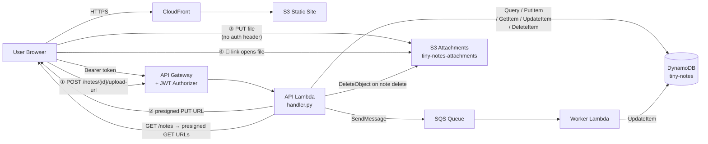

# Tiny Notes Lab — Stage 6

Stage 6 adds **file attachments via S3 presigned URLs**. The browser uploads directly to S3 — the file never passes through Lambda.

## What changed from Stage 5

| Layer | Change |
|-------|--------|
| Frontend | File picker on each note; direct PUT to S3; attachment link after upload |
| API Lambda | New route `POST /notes/{id}/upload-url`; presigned GET URLs in `GET /notes`; S3 cleanup on delete |
| Infrastructure | New private S3 bucket for attachments; S3 CORS policy |

## Files

```
index.html
style.css               ← attachment styles added
app.js                  ← file upload flow added
lambda/
  handler.py            ← S3 routes added
  worker.py             ← unchanged
```

## S3 Bucket Structure

```
tiny-notes-attachments-{account-id}/
  {userId}/             ← Cognito sub — one prefix per user
    {noteId}/           ← note UUID
      {filename}        ← original filename from the browser
```

The prefix hierarchy (`userId/noteId/filename`) means:
- You can list or delete all of one user's files with a single `ListObjectsV2` prefix filter
- You can clean up a note's attachment without knowing the filename by listing under `userId/noteId/`
- IAM prefix conditions can restrict each user to their own objects (useful in future stages)

**One file per note** is enforced at the app level. Uploading a second file overwrites the stored `attachmentKey` in DynamoDB; the old S3 object becomes an orphan (handled by the lifecycle rule below).

---

## How the Upload Flow Works

```
1. User clicks 📎 on a note
2. Browser opens the native file picker
3. app.js calls POST /notes/{id}/upload-url  →  Lambda generates a presigned PUT URL
                                                 and records the key in DynamoDB
4. app.js PUTs the file directly to S3 using that URL
   (no Authorization header — the presigned URL embeds the credentials)
5. loadNotes() refreshes the list
6. Lambda generates a presigned GET URL for the attachment and includes it in the response
7. The 📎 icon becomes a clickable filename link
```

---

## AWS Deployment

### Prerequisites
- Existing setup from Stages 1–5
- AWS CLI configured

---

### Step 1 — Create the Attachments Bucket

```bash
ACCOUNT_ID=$(aws sts get-caller-identity --query Account --output text)
BUCKET_NAME="tiny-notes-attachments-${ACCOUNT_ID}"

aws s3api create-bucket \
  --bucket $BUCKET_NAME \
  --region us-east-1

# Keep the bucket private — access is always through presigned URLs
aws s3api put-public-access-block \
  --bucket $BUCKET_NAME \
  --public-access-block-configuration \
    BlockPublicAcls=true,IgnorePublicAcls=true,\
BlockPublicPolicy=true,RestrictPublicBuckets=true

echo "Bucket: $BUCKET_NAME"
```

---

### Step 2 — Configure S3 CORS

The browser PUTs files directly to S3, which is a cross-origin request. S3 must allow it.

```bash
aws s3api put-bucket-cors \
  --bucket $BUCKET_NAME \
  --cors-configuration '{
    "CORSRules": [{
      "AllowedHeaders": ["*"],
      "AllowedMethods": ["PUT"],
      "AllowedOrigins": ["*"],
      "ExposeHeaders":  ["ETag"],
      "MaxAgeSeconds":  3000
    }]
  }'
```

> In production, replace `"*"` in `AllowedOrigins` with your CloudFront domain.

---

### Step 3 — Add a Lifecycle Rule for Orphaned Objects (Recommended)

When a note is deleted, Lambda cleans up the S3 object. But if a presigned URL is generated and then the upload is abandoned, an incomplete object (or no object) is left in S3. A lifecycle rule auto-expires any objects older than 90 days as a safety net.

```bash
aws s3api put-bucket-lifecycle-configuration \
  --bucket $BUCKET_NAME \
  --lifecycle-configuration '{
    "Rules": [{
      "ID": "expire-old-attachments",
      "Status": "Enabled",
      "Filter": {"Prefix": ""},
      "Expiration": {"Days": 90}
    }]
  }'
```

---

### Step 4 — Update the API Lambda IAM Policy

Stage 6 adds three S3 actions and `dynamodb:GetItem` (used to find the attachment key before deleting a note) and `dynamodb:UpdateItem` (used to store the attachment key).

```bash
aws iam put-role-policy \
  --role-name tiny-notes-lambda-role \
  --policy-name TinyNotesDynamo \
  --policy-document "{
    \"Version\": \"2012-10-17\",
    \"Statement\": [{
      \"Effect\": \"Allow\",
      \"Action\": [
        \"dynamodb:Query\",
        \"dynamodb:PutItem\",
        \"dynamodb:GetItem\",
        \"dynamodb:UpdateItem\",
        \"dynamodb:DeleteItem\"
      ],
      \"Resource\": \"arn:aws:dynamodb:us-east-1:${ACCOUNT_ID}:table/tiny-notes\"
    }]
  }"

aws iam put-role-policy \
  --role-name tiny-notes-lambda-role \
  --policy-name TinyNotesS3Attachments \
  --policy-document "{
    \"Version\": \"2012-10-17\",
    \"Statement\": [{
      \"Effect\": \"Allow\",
      \"Action\": [\"s3:PutObject\", \"s3:GetObject\", \"s3:DeleteObject\"],
      \"Resource\": \"arn:aws:s3:::${BUCKET_NAME}/*\"
    }]
  }"
```

> `s3:PutObject` and `s3:GetObject` are needed to **generate** presigned PUT/GET URLs — the Lambda role's credentials are embedded in the URL. `s3:DeleteObject` is used for cleanup when a note is deleted.

---

### Step 5 — Update the API Lambda

```bash
aws lambda update-function-configuration \
  --function-name tiny-notes \
  --environment "Variables={
    TABLE_NAME=tiny-notes,
    QUEUE_URL=$(aws sqs get-queue-url --queue-name tiny-notes-processing --query QueueUrl --output text),
    ATTACHMENT_BUCKET=${BUCKET_NAME}
  }"

cd lambda && zip api.zip handler.py && cd ..
aws lambda update-function-code \
  --function-name tiny-notes \
  --zip-file fileb://lambda/api.zip
```

---

### Step 6 — Add the New API Gateway Route

The new route reuses the existing Lambda integration and JWT authorizer.

```bash
API_ID=$(aws apigatewayv2 get-apis \
  --query 'Items[?Name==`tiny-notes-api`].ApiId' --output text)

INT_ID=$(aws apigatewayv2 get-integrations --api-id $API_ID \
  --query 'Items[0].IntegrationId' --output text)

AUTH_ID=$(aws apigatewayv2 get-authorizers --api-id $API_ID \
  --query 'Items[?Name==`cognito-jwt`].AuthorizerId' --output text)

aws apigatewayv2 create-route \
  --api-id $API_ID \
  --route-key 'POST /notes/{id}/upload-url' \
  --target "integrations/$INT_ID" \
  --authorization-type JWT \
  --authorizer-id $AUTH_ID
```

The `$default` auto-deploy stage picks this up immediately — no manual deploy needed.

---

### Step 7 — Upload Frontend and Invalidate Cache

```bash
aws s3 sync . s3://your-bucket-name \
  --exclude "*" \
  --include "index.html" \
  --include "style.css" \
  --include "app.js"

aws cloudfront create-invalidation \
  --distribution-id YOUR_DISTRIBUTION_ID \
  --paths "/*"
```

---

## Architecture



---

## What's Next — Stage 7

Add a scheduled maintenance job with **EventBridge**: a daily Lambda that archives notes older than a configurable threshold.
