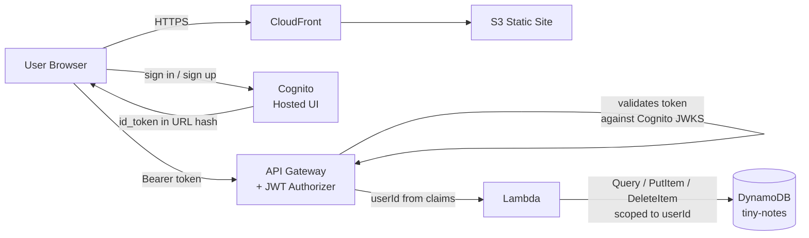

# Tiny Notes Lab — Stage 4

Stage 4 adds **Amazon Cognito** for authentication. Users sign in via the Cognito Hosted UI and each user only sees their own notes.

## What changed from Stage 3

| Layer | Change |
|-------|--------|
| Frontend | Sign in / sign out UI; `Authorization: Bearer <token>` on every API call |
| Lambda | Reads `userId` from verified JWT claims; scopes all DynamoDB operations |
| DynamoDB | Table recreated with composite key: `userId` (PK) + `id` (SK) |
| API Gateway | JWT authorizer added; all routes now require a valid Cognito token |

## Files

```
index.html
style.css
app.js                  ← set COGNITO_DOMAIN and CLIENT_ID before deploying
lambda/
  handler.py
```

## DynamoDB Table Schema

| Attribute   | Type   | Role                          |
|-------------|--------|-------------------------------|
| `userId`    | String | Partition key — Cognito `sub` |
| `id`        | String | Sort key — UUID v4            |
| `text`      | String | Note content                  |
| `createdAt` | String | ISO 8601 UTC timestamp        |

Using `userId` as the partition key means DynamoDB stores each user's notes together. Lambda uses `Query` (not `Scan`) to fetch only the calling user's notes efficiently.

---

## AWS Deployment

### Prerequisites

- Existing S3 bucket, CloudFront distribution, API Gateway, and Lambda from Stages 1–3
- AWS CLI configured

---

### Step 1 — Cognito User Pool

```bash
POOL_ID=$(aws cognito-idp create-user-pool \
  --pool-name tiny-notes-pool \
  --auto-verified-attributes email \
  --username-attributes email \
  --policies 'PasswordPolicy={MinimumLength=8,RequireUppercase=false,RequireLowercase=false,RequireNumbers=false,RequireSymbols=false}' \
  --query 'UserPool.Id' --output text)

echo "Pool ID: $POOL_ID"
```

---

### Step 2 — App Client

The App Client is how the frontend talks to Cognito. No secret — browser apps can't keep secrets.

Replace `YOUR_CLOUDFRONT_DOMAIN` with your CloudFront URL (e.g. `https://xxxx.cloudfront.net`).

```bash
CLIENT_ID=$(aws cognito-idp create-user-pool-client \
  --user-pool-id $POOL_ID \
  --client-name tiny-notes-client \
  --no-generate-secret \
  --allowed-o-auth-flows implicit \
  --allowed-o-auth-scopes openid email \
  --allowed-o-auth-flows-user-pool-client \
  --callback-urls '["https://YOUR_CLOUDFRONT_DOMAIN"]' \
  --logout-urls  '["https://YOUR_CLOUDFRONT_DOMAIN"]' \
  --supported-identity-providers COGNITO \
  --query 'UserPoolClient.ClientId' --output text)

echo "Client ID: $CLIENT_ID"
```

> **Callback URL must match exactly** what `REDIRECT_URI` resolves to in `app.js` (`window.location.origin`). Same for the logout URL.

---

### Step 3 — Hosted UI Domain

The domain must be globally unique. Using a timestamp suffix is a simple way to ensure that.

```bash
DOMAIN_SUFFIX=$(date +%s)
aws cognito-idp create-user-pool-domain \
  --user-pool-id $POOL_ID \
  --domain "tiny-notes-${DOMAIN_SUFFIX}"

echo "COGNITO_DOMAIN: https://tiny-notes-${DOMAIN_SUFFIX}.auth.us-east-1.amazoncognito.com"
```

Copy the printed URL — you'll need it in `app.js`.

---

### Step 4 — Recreate DynamoDB Table

The table schema changes in Stage 4 (composite key). Drop and recreate it.

```bash
aws dynamodb delete-table --table-name tiny-notes
aws dynamodb wait table-not-exists --table-name tiny-notes

aws dynamodb create-table \
  --table-name tiny-notes \
  --attribute-definitions \
    AttributeName=userId,AttributeType=S \
    AttributeName=id,AttributeType=S \
  --key-schema \
    AttributeName=userId,KeyType=HASH \
    AttributeName=id,KeyType=RANGE \
  --billing-mode PAY_PER_REQUEST \
  --region us-east-1
```

Update the IAM policy to replace `dynamodb:Scan` with `dynamodb:Query`:

```bash
aws iam put-role-policy \
  --role-name tiny-notes-lambda-role \
  --policy-name TinyNotesDynamo \
  --policy-document '{
    "Version": "2012-10-17",
    "Statement": [{
      "Effect": "Allow",
      "Action": ["dynamodb:Query", "dynamodb:PutItem", "dynamodb:DeleteItem"],
      "Resource": "arn:aws:dynamodb:us-east-1:YOUR_ACCOUNT_ID:table/tiny-notes"
    }]
  }'
```

---

### Step 5 — Update Lambda

```bash
cd lambda && zip function.zip handler.py && cd ..
aws lambda update-function-code \
  --function-name tiny-notes \
  --zip-file fileb://lambda/function.zip
```

---

### Step 6 — API Gateway JWT Authorizer

The JWT authorizer sits in front of all routes. API Gateway validates the token signature and expiry before Lambda is ever called.

> **Two different URLs to keep straight:**
> - `COGNITO_DOMAIN` in `app.js` — the Hosted UI: `https://tiny-notes-XXX.auth.us-east-1.amazoncognito.com`
> - `Issuer` below — the Cognito service URL that appears in the JWT `iss` claim: `https://cognito-idp.REGION.amazonaws.com/POOL_ID`

```bash
API_ID=$(aws apigatewayv2 get-apis \
  --query 'Items[?Name==`tiny-notes-api`].ApiId' --output text)

AUTH_ID=$(aws apigatewayv2 create-authorizer \
  --api-id $API_ID \
  --authorizer-type JWT \
  --identity-source '$request.header.Authorization' \
  --name cognito-jwt \
  --jwt-configuration \
    Issuer="https://cognito-idp.us-east-1.amazonaws.com/${POOL_ID}",Audience="${CLIENT_ID}" \
  --query 'AuthorizerId' --output text)

# Apply the authorizer to all three routes
for ROUTE_KEY in 'GET /notes' 'POST /notes' 'DELETE /notes/{id}'; do
  ROUTE_ID=$(aws apigatewayv2 get-routes --api-id $API_ID \
    --query "Items[?RouteKey=='${ROUTE_KEY}'].RouteId" --output text)
  aws apigatewayv2 update-route \
    --api-id $API_ID \
    --route-id $ROUTE_ID \
    --authorization-type JWT \
    --authorizer-id $AUTH_ID
done
```

Any request without a valid Cognito token now gets a `401 Unauthorized` from API Gateway — Lambda is never invoked.

**Also update the API's CORS configuration to allow the `Authorization` header.**

Stage 3 only listed `Content-Type`. Now that every request sends `Authorization: Bearer <token>`, the browser sends a CORS preflight `OPTIONS` request with `Access-Control-Request-Headers: authorization`. Without `Authorization` in `AllowHeaders`, the preflight fails and the browser blocks the call before it ever reaches the authorizer.

```bash
aws apigatewayv2 update-api \
  --api-id $API_ID \
  --cors-configuration \
    'AllowOrigins=["*"],AllowMethods=["GET","POST","DELETE"],AllowHeaders=["Content-Type","Authorization"]'
```

---

### Step 7 — Update the Frontend

In `app.js`, set the two new constants:

```javascript
const COGNITO_DOMAIN = 'https://tiny-notes-TIMESTAMP.auth.us-east-1.amazoncognito.com';
const CLIENT_ID      = 'your-client-id-from-step-2';
```

`API_BASE` is already set from Stage 3.

---

### Step 8 — Upload to S3 and Invalidate Cache

```bash
aws s3 sync . s3://your-bucket-name \
  --exclude "*" \
  --include "index.html" \
  --include "style.css" \
  --include "app.js"

aws cloudfront create-invalidation \
  --distribution-id YOUR_DISTRIBUTION_ID \
  --paths "/*"
```

---

## How the Auth Flow Works

```
1. User clicks "Sign In / Sign Up"
2. Browser redirects to Cognito Hosted UI
3. User signs up or signs in
4. Cognito redirects back to the app with id_token in the URL hash
5. app.js stores the token in localStorage and clears it from the URL
6. All API calls send: Authorization: Bearer <id_token>
7. API Gateway validates the token against Cognito's JWKS endpoint
8. Lambda reads userId from event.requestContext.authorizer.jwt.claims.sub
9. DynamoDB Query scopes results to that userId
```

---

## Architecture



---

## What's Next — Stage 5

Add async background processing with **SQS**: when a note is created, queue a worker Lambda to enrich it with a derived field.
