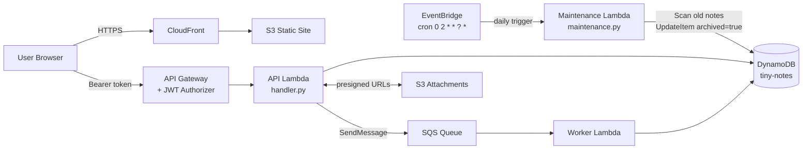

# Tiny Notes Lab — Stage 7

Stage 7 adds **scheduled automation with EventBridge**. A maintenance Lambda runs once per day and archives notes older than a configurable number of days.

## What changed from Stage 6

| Layer              | Change                                                                    |
| ------------------ | ------------------------------------------------------------------------- |
| Frontend           | Grey "archived" badge + struck-through text for archived notes            |
| Maintenance Lambda | New — triggered by EventBridge; scans DynamoDB and sets `archived = true` |
| Infrastructure     | EventBridge scheduled rule + Lambda invocation permission                 |

## Files

```
index.html
style.css               ← archived badge style added
app.js                  ← archived indicator in renderNotes
lambda/
  handler.py            ← unchanged
  worker.py             ← unchanged
  maintenance.py        ← new scheduled Lambda
```

## How It Works

```
EventBridge rule fires at 2:00 AM UTC every day
  └─▶ maintenance.py Lambda invoked with empty payload {}
        └─▶ DynamoDB Scan: createdAt < (now - ARCHIVE_AFTER_DAYS)
                             AND (archived not exists OR archived = false)
              └─▶ UpdateItem: SET archived = true  (for each matching note)
```

`ARCHIVE_AFTER_DAYS` defaults to `30`. Change it via the Lambda environment variable without redeploying code.

### Why `Attr('archived').not_exists()` is needed

DynamoDB evaluates a missing attribute as NULL. `NULL ≠ true` returns **false** — not true — so `ne(True)` alone silently skips every note that predates Stage 7. The explicit `not_exists()` condition catches those notes correctly.

---

## AWS Deployment

### Prerequisites

- Existing setup from Stages 1–6
- AWS CLI configured

---

### Step 1 — IAM Role for the Maintenance Lambda

```bash
aws iam create-role \
  --role-name tiny-notes-maintenance-role \
  --assume-role-policy-document '{
    "Version": "2012-10-17",
    "Statement": [{
      "Effect": "Allow",
      "Principal": {"Service": "lambda.amazonaws.com"},
      "Action": "sts:AssumeRole"
    }]
  }'

# CloudWatch Logs
aws iam attach-role-policy \
  --role-name tiny-notes-maintenance-role \
  --policy-arn arn:aws:iam::aws:policy/service-role/AWSLambdaBasicExecutionRole

# DynamoDB — Scan to find old notes, UpdateItem to archive them
ACCOUNT_ID=$(aws sts get-caller-identity --query Account --output text)

aws iam put-role-policy \
  --role-name tiny-notes-maintenance-role \
  --policy-name TinyNotesMaintenanceDynamo \
  --policy-document "{
    \"Version\": \"2012-10-17\",
    \"Statement\": [{
      \"Effect\": \"Allow\",
      \"Action\": [\"dynamodb:Scan\", \"dynamodb:UpdateItem\"],
      \"Resource\": \"arn:aws:dynamodb:us-east-1:${ACCOUNT_ID}:table/tiny-notes\"
    }]
  }"
```

---

### Step 2 — Create the Maintenance Lambda

```bash
MAINT_ROLE_ARN=$(aws iam get-role \
  --role-name tiny-notes-maintenance-role \
  --query 'Role.Arn' --output text)

cd lambda && zip maintenance.zip maintenance.py && cd ..

aws lambda create-function \
  --function-name tiny-notes-maintenance \
  --runtime python3.12 \
  --handler maintenance.handler \
  --role $MAINT_ROLE_ARN \
  --zip-file fileb://lambda/maintenance.zip \
  --environment Variables={TABLE_NAME=tiny-notes,ARCHIVE_AFTER_DAYS=30} \
  --timeout 60 \
  --region us-east-1
```

> Timeout is 60 s to allow for large table scans. Adjust `ARCHIVE_AFTER_DAYS` without redeploying by updating the environment variable.

**To redeploy after code changes:**

```bash
cd lambda && zip maintenance.zip maintenance.py && cd ..
aws lambda update-function-code \
  --function-name tiny-notes-maintenance \
  --zip-file fileb://lambda/maintenance.zip
```

---

### Step 3 — Create the EventBridge Scheduled Rule

```bash
RULE_ARN=$(aws events put-rule \
  --name tiny-notes-daily-maintenance \
  --schedule-expression "cron(0 2 * * ? *)" \
  --state ENABLED \
  --query 'RuleArn' --output text)

echo "Rule ARN: $RULE_ARN"
```

> `cron(0 2 * * ? *)` = 2:00 AM UTC every day. EventBridge cron has six fields — the `?` in position 6 (day-of-week) is required when position 4 (day-of-month) is `*`.

---

### Step 4 — Grant EventBridge Permission to Invoke the Lambda

```bash
MAINT_ARN=$(aws lambda get-function \
  --function-name tiny-notes-maintenance \
  --query 'Configuration.FunctionArn' --output text)

aws lambda add-permission \
  --function-name tiny-notes-maintenance \
  --statement-id eventbridge-daily \
  --action lambda:InvokeFunction \
  --principal events.amazonaws.com \
  --source-arn $RULE_ARN
```

---

### Step 5 — Set the Lambda as the Rule Target

```bash
aws events put-targets \
  --rule tiny-notes-daily-maintenance \
  --targets "Id=maintenance-lambda,Arn=${MAINT_ARN}"
```

---

### Step 6 — Test Without Waiting for the Schedule

Invoke the Lambda immediately to verify it works before tomorrow:

```bash
aws lambda invoke \
  --function-name tiny-notes-maintenance \
  --payload '{}' \
  --cli-binary-format raw-in-base64-out \
  response.json

cat response.json
# {"archived": 2, "cutoff": "2026-03-25T..."}
```

The response shows how many notes were archived and the cutoff timestamp used.

Note:

- If you're testing locally, you may also change the CreatedAt value directly in the DynamoDB console to test the rule.
- And change the EventBridge to run once per minute instead of once per day to test the Lambda without waiting for the scheduled time.

### Step 7 — Upload Frontend and Invalidate Cache

```bash
aws s3 sync . s3://your-bucket-name \
  --exclude "*" \
  --include "index.html" \
  --include "style.css" \
  --include "app.js"

aws cloudfront create-invalidation \
  --distribution-id YOUR_DISTRIBUTION_ID \
  --paths "/*"
```

---

## Architecture



---

## What's Next — Stage 8

Add **CloudWatch** observability: structured logging, a dashboard, and alarms for Lambda errors, API 5xx responses, and DLQ message depth.
