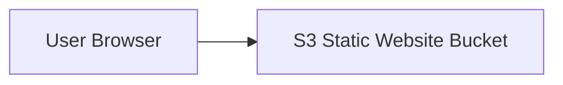
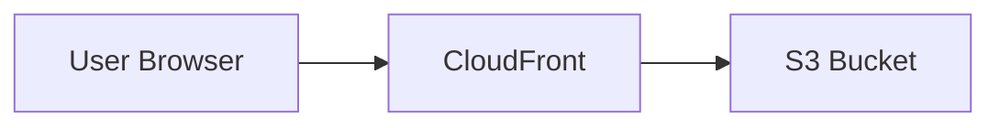
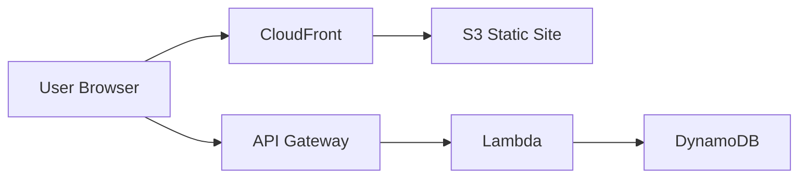
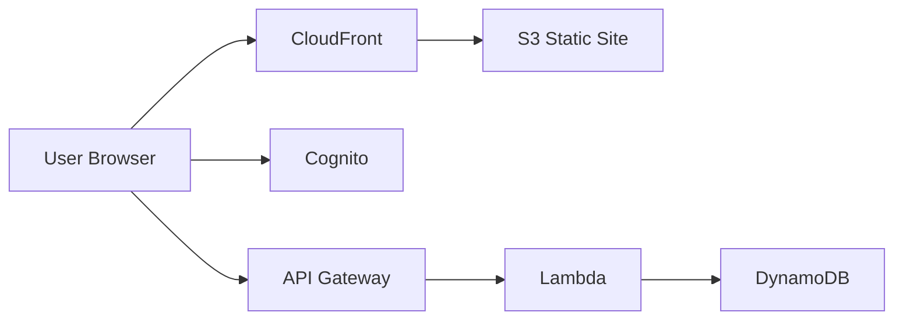
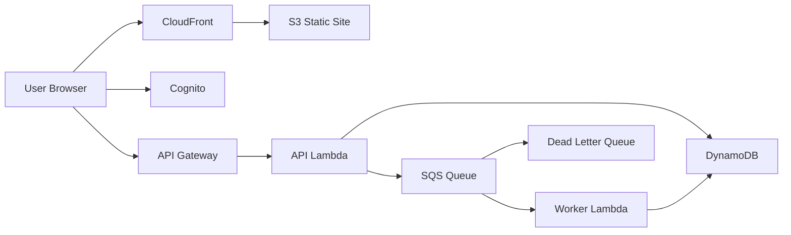
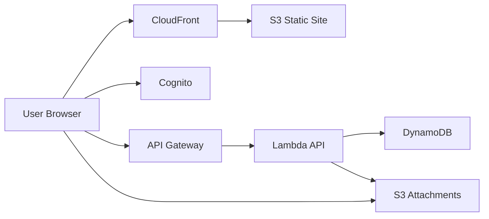
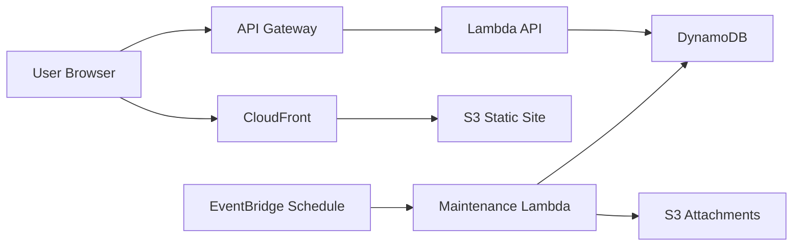
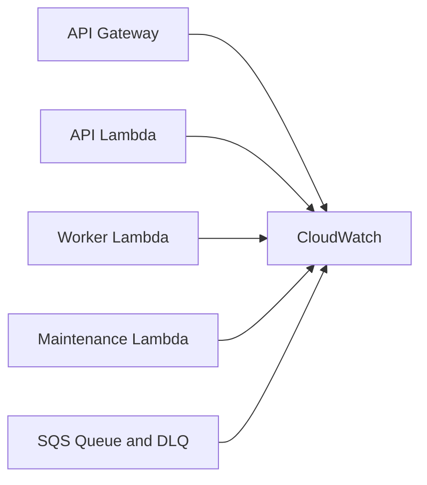

# AWS Practice Lab Roadmap

This roadmap is designed around one intentionally minimal application that evolves in small steps so the learning focus stays on AWS, not product complexity.

Core app for all stages: `Tiny Notes Lab`

Principles:

- Keep the application minimal.
- Add only enough app behavior to justify each new AWS service.
- Prefer plain HTML, CSS, and vanilla JavaScript unless a stage truly requires more.
- Favor free-tier-friendly choices where possible.
- Ask the AI for runnable code, not pseudo-code.

## Stage Progression

1. Stage 1: Static notes app on `S3`
2. Stage 2: Add `CloudFront`
3. Stage 3: Add backend with `API Gateway + Lambda + DynamoDB`
4. Stage 4: Add auth with `Cognito`
5. Stage 5: Add async processing with `SQS`
6. Stage 6: Add file uploads with `S3 presigned URLs`
7. Stage 7: Add scheduled automation with `EventBridge`
8. Stage 8: Add observability with `CloudWatch`

## Global Prompt Rules

Include these in every AI prompt:

```text
- Keep the app intentionally tiny
- Prefer plain HTML/CSS/JS unless a stage truly needs otherwise
- Avoid complex domain logic
- Avoid overengineering
- Output runnable code, not pseudo-code
- Explain AWS resources briefly
- Include a Mermaid architecture diagram
- Include a short deployment guide
- Keep costs and free-tier friendliness in mind
```

---

## Stage 1: Static App on S3

### Goal

Create a tiny frontend-only notes app. Notes live in browser `localStorage`.

### AWS Focus

- `S3` static website hosting

### App Scope

- List notes
- Add note
- Delete note
- Persist notes in browser `localStorage`

### AI Prompt

```text
Build Stage 1 of a learning project called "Tiny Notes Lab".

Requirements:
- Create a very small frontend-only notes app.
- Use plain HTML, CSS, and vanilla JavaScript only.
- Features:
  - list notes
  - add note
  - delete note
  - persist notes in browser localStorage
- Keep the UI minimal and clean.
- File structure should be tiny and easy to understand.
- No frameworks, no build step, no backend.

Output:
1. Full source code
2. README with local run instructions
3. A brief AWS deployment guide for hosting this static site on Amazon S3 static website hosting
4. A Mermaid architecture diagram for this stage
5. Keep the application intentionally simple because this project is for learning AWS, not app complexity
```

### Brief AWS Deploy Guide

1. Create an S3 bucket.
2. Enable static website hosting.
3. Upload `index.html`, `style.css`, and `app.js`.
4. For lab use, allow public read if using direct S3 website hosting.

### Architecture Diagram



---

## Stage 2: Add CloudFront

### Goal

Keep the app unchanged and add CDN delivery.

### AWS Focus

- `CloudFront`
- Optional `ACM`

### App Scope

- Same frontend-only notes app
- Same browser `localStorage`

### AI Prompt

```text
Upgrade "Tiny Notes Lab" to Stage 2.

Current app:
- static notes app in plain HTML/CSS/JS
- notes stored in localStorage
- hosted from S3

Requirements:
- Keep the app functionality the same
- Keep source code minimal
- Update the README with a brief AWS deployment guide for:
  - S3 as origin
  - CloudFront distribution in front of S3
  - optional ACM certificate note for HTTPS/custom domain
- Include cache invalidation guidance for updates
- Include a Mermaid architecture diagram

Output:
1. Updated source code if needed
2. Short deployment steps
3. Mermaid architecture diagram
4. Keep the app simple and AWS-focused
```

### Brief AWS Deploy Guide

1. Keep the S3 bucket as the origin.
2. Create a CloudFront distribution.
3. Point CloudFront to the S3 origin.
4. Invalidate the CloudFront cache after frontend updates.
5. Optionally attach an ACM certificate and custom domain later.

### Architecture Diagram



---

## Stage 3: Add Real Backend

### Goal

Move notes from browser storage into AWS-managed backend services.

### AWS Focus

- `API Gateway`
- `Lambda`
- `DynamoDB`

### App Scope

- List notes
- Create note
- Delete note

Minimal data model:

- `id`
- `text`
- `createdAt`

### AI Prompt

```text
Upgrade "Tiny Notes Lab" to Stage 3.

Current app:
- static frontend hosted on S3/CloudFront
- notes currently stored in localStorage

New requirements:
- Replace localStorage with a real backend on AWS
- Use:
  - Amazon API Gateway
  - AWS Lambda
  - Amazon DynamoDB
- Features:
  - list notes
  - create note
  - delete note
- Keep the data model minimal:
  - id
  - text
  - createdAt
- Frontend should remain plain HTML/CSS/JS
- Backend should be small and easy to read
- Include CORS setup guidance
- Prefer one DynamoDB table
- Keep the code intentionally simple for learning

Output:
1. Full frontend source code
2. Full Lambda source code
3. Suggested DynamoDB table schema
4. README with brief deployment steps for S3, API Gateway, Lambda, DynamoDB
5. Mermaid architecture diagram
```

### Brief AWS Deploy Guide

1. Create a DynamoDB table.
2. Create a Lambda function with note CRUD handlers.
3. Expose Lambda through API Gateway.
4. Enable CORS.
5. Update the frontend with the API base URL.
6. Deploy the frontend to S3 and CloudFront.

### Architecture Diagram



---

## Stage 4: Add User Login

### Goal

Allow each user to sign in and only access their own notes.

### AWS Focus

- `Cognito`

### App Scope

- Sign up
- Sign in
- Sign out
- Per-user note access

### AI Prompt

```text
Upgrade "Tiny Notes Lab" to Stage 4.

Current architecture:
- static frontend on S3/CloudFront
- API Gateway + Lambda + DynamoDB backend

New requirements:
- Add authentication with Amazon Cognito
- Users can sign up, sign in, and sign out
- Each user should only access their own notes
- Do not introduce large frontend frameworks
- Store notes in DynamoDB with user scoping
- API requests should require authentication

Output:
1. Updated frontend source code
2. Updated backend source code
3. Brief Cognito setup instructions
4. Brief deployment steps
5. Mermaid architecture diagram
```

### Brief AWS Deploy Guide

1. Create a Cognito User Pool and App Client.
2. Update the frontend to authenticate users.
3. Send the JWT with API requests.
4. Configure API Gateway authorizer or validate tokens in Lambda.
5. Partition DynamoDB data by user identity.

### Architecture Diagram



---

## Stage 5: Add Async Processing

### Goal

When a note is created, process extra derived data asynchronously.

### AWS Focus

- `SQS`
- Lambda event processing
- `DLQ`

### App Scope

When a note is created:

- Save it immediately
- Queue background processing
- Update note with fields like:
  - `summary`
  - `processedStatus`
  - `processedAt`

### AI Prompt

```text
Upgrade "Tiny Notes Lab" to Stage 5.

Current architecture:
- frontend on S3/CloudFront
- Cognito auth
- API Gateway + Lambda + DynamoDB

New requirements:
- When a note is created, do not do all work synchronously
- Send a message to Amazon SQS
- A second Lambda consumes the queue
- The worker updates the note with a derived field such as:
  - summary
  - processedStatus
  - processedAt
- Add a dead-letter queue
- Frontend should show processing status

Output:
1. Updated frontend code
2. Updated API Lambda code
3. Worker Lambda code
4. Queue and DLQ design notes
5. AWS deployment guide
6. Mermaid architecture diagram
```

### Brief AWS Deploy Guide

1. Create an SQS queue and DLQ.
2. Update the API Lambda to send a message after note creation.
3. Create a worker Lambda subscribed to the queue.
4. Update the worker to write results back to DynamoDB.
5. Show processing status in the frontend.

### Architecture Diagram



---

## Stage 6: Add File Attachments

### Goal

Allow a user to attach one small file to a note.

### AWS Focus

- `S3` uploads
- Presigned URLs

### App Scope

- Choose one file
- Upload directly to S3
- Save file metadata with the note
- Show attachment link

### AI Prompt

```text
Upgrade "Tiny Notes Lab" to Stage 6.

Current architecture:
- authenticated notes app
- API backend
- async processing with SQS

New requirements:
- Allow a user to attach one file to a note
- Use Amazon S3 for file storage
- Backend should generate presigned upload URLs
- Store file metadata in DynamoDB
- Frontend should support:
  - choosing a file
  - uploading directly to S3 with a presigned URL
  - showing attachment link after upload
- Keep UI and code minimal
- Keep the purpose focused on AWS integration

Output:
1. Updated frontend source code
2. Updated backend code for presigned URL generation
3. Suggested S3 bucket structure
4. Brief deployment guide
5. Mermaid architecture diagram
```

### Brief AWS Deploy Guide

1. Create an S3 bucket for attachments.
2. Add an API endpoint that generates presigned upload URLs.
3. Upload files directly from the browser to S3.
4. Save attachment metadata in DynamoDB.
5. Add basic access control later if needed.

### Architecture Diagram



---

## Stage 7: Add Scheduled Automation

### Goal

Run a simple daily maintenance job.

### AWS Focus

- `EventBridge` schedule

### App Scope

Choose one:

- Archive old notes
- Delete temporary notes after a threshold

### AI Prompt

```text
Upgrade "Tiny Notes Lab" to Stage 7.

Current architecture:
- notes app with auth, queue processing, and S3 attachments

New requirements:
- Add a scheduled background task using Amazon EventBridge
- Once per day, run a Lambda that:
  - archives notes older than a chosen number of days
  or
  - deletes notes marked temporary
- Keep the logic simple
- Frontend only needs a small archived status indicator if necessary
- Keep implementation minimal and AWS-focused

Output:
1. Updated backend code
2. Scheduled Lambda code
3. Brief deployment steps for EventBridge schedule
4. Mermaid architecture diagram
```

### Brief AWS Deploy Guide

1. Create an EventBridge scheduled rule.
2. Trigger a maintenance Lambda once per day.
3. Update or archive data in DynamoDB.
4. Optionally clean up related S3 attachments.

### Architecture Diagram



---

## Stage 8: Add Observability

### Goal

Improve operational visibility without increasing product complexity.

### AWS Focus

- `CloudWatch Logs`
- Metrics
- Alarms
- Dashboards

### App Scope

- No major product features
- Mostly instrumentation and visibility

### AI Prompt

```text
Upgrade "Tiny Notes Lab" to Stage 8.

Current architecture:
- frontend
- API Gateway, Lambda, DynamoDB
- Cognito
- SQS worker
- S3 attachments
- EventBridge scheduler

New requirements:
- Add observability guidance using Amazon CloudWatch
- Include:
  - structured logging in Lambda
  - key custom metrics if appropriate
  - CloudWatch dashboard suggestions
  - alarm suggestions for Lambda errors, DLQ messages, and API failures
- Keep app code changes minimal
- Focus on AWS operational visibility

Output:
1. Any minimal source-code updates for logging
2. Brief observability setup guide
3. Dashboard and alarm recommendations
4. Mermaid architecture diagram
```

### Brief AWS Deploy Guide

1. Ensure Lambda functions emit structured logs.
2. Create a CloudWatch dashboard for core metrics.
3. Add alarms for Lambda errors, API 5xx responses, and DLQ depth.
4. Review logs and metrics after test traffic.

### Architecture Diagram



---

## Recommended Execution Order

Prompt the AI in this order:

1. Stage 1
2. Stage 2
3. Stage 3
4. Stage 4
5. Stage 5
6. Stage 6
7. Stage 7
8. Stage 8

## Notes

- Keep one repo and evolve the same app over time.
- Resist the temptation to add extra product features.
- The educational value comes from isolating AWS service adoption stage by stage.
